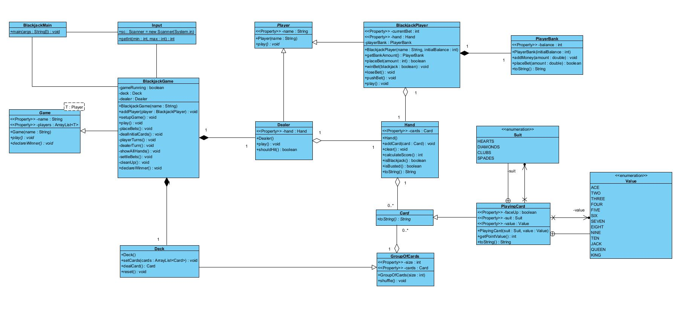

# Blackjack Game

A console-based Blackjack (21) game implementation in Java, supporting multiple players with betting mechanics and standard casino rules.

This project is a fully functional text-based Blackjack card game developed in Java as part of my enterprise Java course at Sheridan College. The game simulates a casino blackjack table where 1-7 players can compete against a dealer, managing their bankrolls through multiple rounds of play.

The implementation follows object-oriented programming principles with a clear class hierarchy, separating concerns between game logic, player management, card handling, and user interaction. Players can place bets, make strategic hit/stand decisions, and track their winnings across multiple rounds until they choose to leave or run out of money. The game enforces standard casino rules, including automatic dealer play, proper blackjack payouts (3:2), and ace value calculation from 11 - 1 to prevent unnecessary busts. However, what this program does not offer is the ability to split cards or place side bets.

.png)

## Features

- **Multiple Players**: Support for 1-7 players simultaneously
- **Banking System**: Each player manages their own bankroll
- **Standard Blackjack Rules**: 
  - Dealer hits on 16 or less, stands on 17+
  - Blackjack pays 3:2
  - Regular wins pay 1:1
  - Push returns the bet
- **Automatic Deck Management**: Deck reshuffles when running low
- **Interactive Gameplay**: Hit or stand decisions for each player
- **Win Tracking**: Final bankroll comparison to determine the overall winner

## Class Structure



### Core Classes
- **BlackjackGame**: Main game controller managing rounds, betting, and game flow
- **BlackjackPlayer**: Represents a player with hand and bankroll management
- **Dealer**: Special player following dealer rules
- **Hand**: Manages card collections and scoring logic
- **Deck**: 52-card deck with shuffling and dealing functionality
- **PlayingCard**: Individual card representation with suit and value
- **PlayerBank**: Handles player's money and betting operations

### Base Classes (Framework)
- **Game**: Abstract base game class
- **Player**: Abstract base player class
- **Card**: Abstract base card class
- **GroupOfCards**: Base class for card collections

## How to Run

### Prerequisites
- Java JDK 8 or higher

### Compilation
```bash
javac ca/sheridancollege/project/*.java
```

### Execution
```bash
java ca.sheridancollege.project.BlackjackMain
```

## Gameplay Instructions

1. **Setup**: Enter the number of players (1-7)
2. **Player Registration**: Enter each player's name and starting bankroll ($100-$10,000)
3. **Betting Phase**: Each player places a bet (or enters 0 to leave)
4. **Dealing**: Each player and the dealer receive two cards
5. **Player Turns**: Choose to Hit (take a card) or Stand (keep current hand)
6. **Dealer's Turn**: Dealer plays automatically following casino rules
7. **Settlement**: Winners are paid, losers forfeit their bets
8. **Continue or Quit**: Choose to play another round or end the game

## Game Rules

- **Blackjack**: 21 points with two cards (pays 3:2)
- **Bust**: Over 21 points (automatic loss)
- **Push**: Tie with dealer (bet returned)
- **Ace Values**: Automatically calculated as 1 or 11 to optimize hand
- **Face Cards**: Jack, Queen, King all worth 10 points
- **Dealer Rules**: Must hit on 16 or less, must stand on 17 or more

## Screenshots

### Gameplay Example
.png)
*Final results showing winners and bankrolls*
*Player making hit/stand decisions during their turn*

### Game Completion
.png)
*Player pulls ace of hearts, displaying updated card from value of 11 to value of 1*


## Authors

- **Steven Mahabir** - Primary Developer
- **AlexY** - Input validation utilities
- **Brian** - Input validation utilities
- **dancye** - Base framework
- **Paul Bonenfant** - Base framework (Jan 2020)

## Course Information

SYST 17796 Project - Sheridan College
